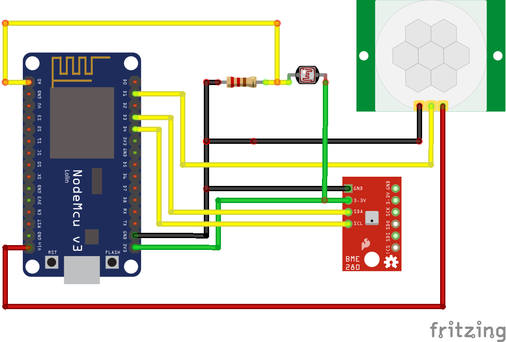

# NodeMCU Room Sensor

Code for a HomeKit compatible NodeMCU room sensor.

## Hardware

* NodeMCU V3
* BME280 precision temperature, air humidity and atmospheric pressure sensor
* HC-SR501 PIR motion sensor
* 10k Photoresistor

## Installation

### NodeMCU

### Homebridge

### Home App
